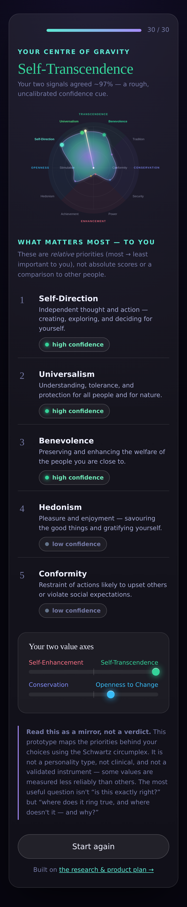
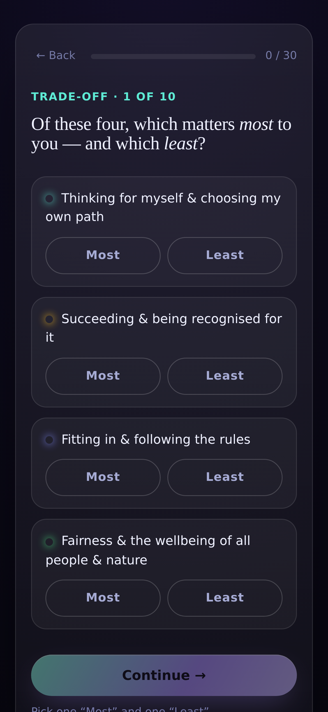

# Compass — a values-discovery app (MVP)

A research-grounded experience that helps people discover their **real, operative
values** — the priorities they actually live by, not the aspirational self-image a
one-shot quiz returns. Built on the **Schwartz Theory of Basic Human Values** and
its circular (circumplex) structure.

> This is **step 1** of the build described in
> [`../values-app/RESEARCH_AND_PLAN.md`](./RESEARCH_AND_PLAN.md): the scientific
> **engine** plus a polished **web experience**. It is a prototype — the items are
> original and **not yet psychometrically validated**, and it makes no clinical claims.


**Mobile-adaptive & installable.** The experience is mobile-first responsive (safe-area
aware, big thumb-friendly tap targets, the circumplex scales without clipping) and ships
as an installable **PWA** — add it to a phone home screen and it runs full-screen and
offline.

 

## Why this design (the short version)

- **Backbone — Schwartz values.** The only individual-level value model that is
  comprehensive, the most cross-culturally replicated, and structured as a circle
  with two bipolar axes (Openness↔Conservation, Self-Enhancement↔Self-Transcendence)
  — so it can show *trade-offs and tensions*, not just a ranked list.
- **Triangulation, not a single quiz.** A pure questionnaire surfaces the
  aspirational self. We combine a **forced-choice / MaxDiff trade-off** module (the
  best-evidenced lever for *operative* priorities) with an indirect **portrait
  questionnaire**, and report where the two **agree** as a heuristic confidence cue.
- **Honesty over mysticism.** Relative priorities (never a "type"), visible
  uncertainty, opposing-value tensions surfaced, and explicit "mirror, not a verdict"
  framing — designed to avoid the Barnum/Forer effect.

See the full reasoning, evidence, and the open problems (individual-vs-group
validity, change-score reliability, licensing, clinical safety) in
[`RESEARCH_AND_PLAN.md`](./RESEARCH_AND_PLAN.md).

## Run it

No build step, no runtime dependencies — just Node ≥ 22.6.

```bash
cd values-app
npm run serve      # → http://localhost:5173/
npm test           # run the engine unit tests (10 tests)
npm run demo       # print synthetic archetype profiles in the terminal
```

## How it works

```
engine/                 # pure ESM, runs in Node AND the browser (no build)
  values.js             #   the 10 values, circumplex angles, higher-order axes, tensions
  portraitItems.js      #   original portrait items (1–6 "how like you is this person?")
  maxdiffBlocks.js      #   balanced best–worst trade-off blocks (each value appears 4×)
  scoring.js            #   centering (ipsatization), best–worst, triangulation, confidence
web/                    # the experience (vanilla JS + SVG + CSS, imports the engine directly)
  index.html  styles.css  app.js  circumplex.js  serve.js
test/scoring.test.js    # node:test unit tests
demo/                   # synthetic respondents + CLI demo
scripts/screenshots.mjs # dev-only: capture the four screens (needs playwright-core)
```

### The scoring pipeline

1. **Portrait** ratings are *centered* on each person's mean (Schwartz
   ipsatization) → relative priorities, with scale-use bias removed.
2. **MaxDiff** choices become best–worst counts per value, normalised by appearances.
3. Both signals are standardised within-person and **averaged** → a combined
   priority for each value.
4. Combined priorities are **projected onto the circumplex** (a weighted vector
   sum), yielding the dominant orientation, higher-order axis positions,
   cross-signal convergence (a *heuristic, uncalibrated* confidence indicator),
   and opposing-value tensions.

## Honest limitations (read these)

- The portrait/MaxDiff items are **original prototypes**, not the validated PVQ-RR
  (which is copyrighted and would need licensing).
- "Confidence" is a heuristic from cross-signal agreement — **not** a calibrated
  statistic. Naive best–worst counts are ipsative; a production build should move to
  **Thurstonian-IRT** scoring.
- Single-value reliability is weak for short scales; the honest readout leans on the
  **higher-order axes** and the circumplex structure. Not clinical, not a diagnosis,
  not a personality "type."
