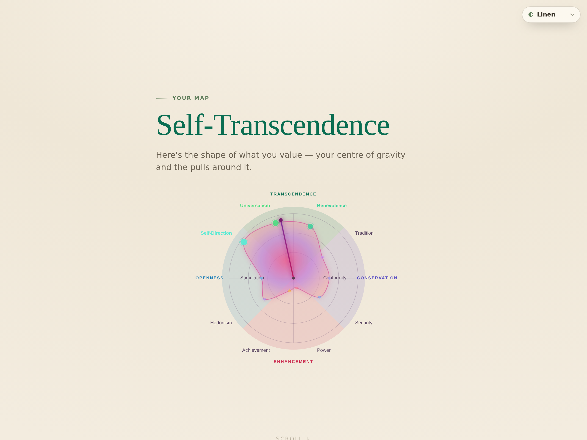

# Compass — the values test that shows its work

A research-grounded experience that helps people discover the **values they
actually prioritise** — not the flattering, aspirational self-image a one-shot
quiz returns. Built on the **Schwartz Theory of Basic Human Values** and its
circular (circumplex) structure.

Its differentiator is **honesty made visible**: it elicits two independent
signals, cross-checks them, and *shows you where they agree and where they
don't* — instead of dressing a single quiz in the language of certainty. No
personality "type," no invented percentages, and an explicit **"no clear lean
yet"** result when the data doesn't support a verdict.

> This is a **prototype**. The items are original and **not yet psychometrically
> validated**, and it makes no clinical claims. See `RESEARCH_AND_PLAN.md` for
> the full evidence base and open problems, and `docs/ROADMAP-100X.md` for where
> this build stands and what comes next.



**Mobile-adaptive, accessible & installable.** The experience is mobile-first
responsive, the sort works by **drag *or* keyboard** (with live screen-reader
announcements), and it ships as an installable **PWA** that runs full-screen and
offline.

## What it does (the honest version)

- **Backbone — Schwartz values.** The most cross-culturally replicated
  individual-level value model, structured as a circle with two bipolar axes
  (Openness↔Conservation, Self-Enhancement↔Self-Transcendence) — so it shows
  *trade-offs and tensions*, not just a ranked list.
- **Two signals, cross-checked.** You **rank all ten values** in one sort, then
  make **ten forced trade-offs** ("which matters most / least — you can't keep
  all four"). The two are scored independently and combined; where they agree we
  show high confidence, where they diverge we say so.
- **Honesty over mysticism.** Continuum positions (never a "type"), per-value
  confidence chips, an uncertainty-gated "centre of gravity," opposing-value
  tensions surfaced, career verdicts that **abstain** when the signal is
  indistinguishable from noise, and an explicit "mirror, not a verdict" frame —
  all designed to defeat the Barnum/Forer effect.
- **The stated-vs-lived gap.** Optionally sort the same ten values by *what your
  last two weeks actually served* — the divergence, with one concrete action per
  neglected value, is the most useful thing the app can show you.
- **Your result is yours.** Everything runs client-side; your result is encoded
  in the URL so it's shareable and re-openable, and **nothing is stored on any
  server**.

## Run it

No build step, no runtime dependencies — just Node ≥ 18.

```bash
npm run serve      # → http://localhost:5173/  (dev: no asset caching)
npm test           # run the engine unit tests (36 tests)
npm run demo       # print synthetic archetype profiles in the terminal
```

For production (`NODE_ENV=production`) the server enables in-memory asset
caching with gzip + ETags; `railway.json` runs `node web/serve.js`.

## How it works

```
engine/                 # pure ESM, runs in Node AND the browser (no build)
  values.js             #   the 10 values, circumplex angles, higher-order axes, tensions
  maxdiffBlocks.js      #   balanced best–worst blocks (each value 4×; opposites forced to compete)
  scoring.js            #   ipsatization, best–worst, triangulation, convergence, confidence
  identity.js           #   continuum synthesis (headline + two-axis position — NO type labels)
  careerArchetypes.js   #   values→archetype exploration with noise-calibrated bands + abstain
  relationshipCompass.js#   reflection + conversation prompts (NO partner prediction — Finkel firewall)
  portraitItems.js      #   original portrait items — used by tests/demo only (see licensing note)
web/                    # the experience (vanilla JS + SVG + CSS, imports the engine directly)
  index.html  styles.css  app.js  circumplex.js  sw.js  serve.js
test/                   # node:test unit tests incl. guardrails + retake-invariance
demo/                   # synthetic respondents + CLI demo
```

### The scoring pipeline

1. The **full ranking** (one sort of all ten values) becomes a position score
   per value.
2. **MaxDiff** trade-offs become best–worst counts per value, normalised by
   appearances. The block design forces *direct opposites* to compete.
3. Both signals are standardised within-person and **averaged** → a combined
   priority for each value.
4. Combined priorities are **projected onto the circumplex**, yielding the
   dominant orientation (gated on margin), cross-signal convergence, per-value
   confidence, and globally-anchored opposing-value tensions.

Because the whole ranking is elicited in one comparable sort, the result is
**stable across retakes** — a regression test asserts the profile is invariant
to input order.

## Honest limitations (read these)

- The sort/MaxDiff items are **original prototypes**, not the validated PVQ-RR
  (which is copyrighted and would need licensing). The portrait instrument
  (`engine/portraitItems.js`) is **deliberately kept out of the shipped browser
  bundle** pending a licensing determination — it powers tests/demos only.
- "Confidence" is a heuristic from cross-signal agreement — **not** a calibrated
  statistic. Career bands are calibrated against a random-input baseline (so
  "strong lean" means "beats ~95% of random sorts"), not against outcome data.
- A single-session sort measures *stated* priorities. The stated-vs-lived module
  is the first honest step toward *lived* values; it is not EMA or behavioural
  data. Not clinical, not a diagnosis, not a personality "type."
